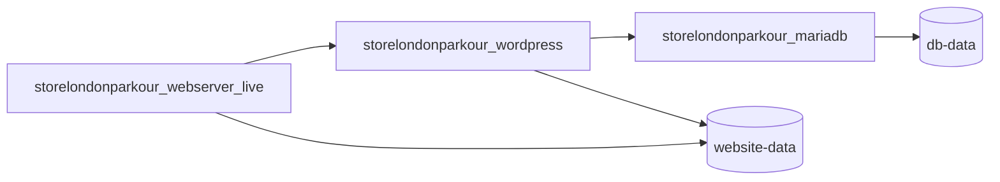
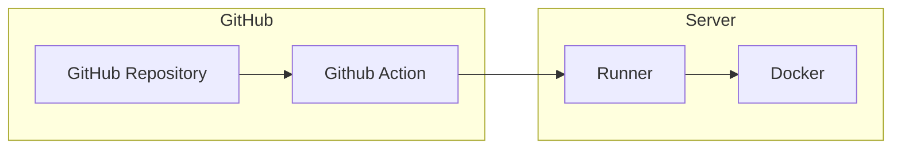
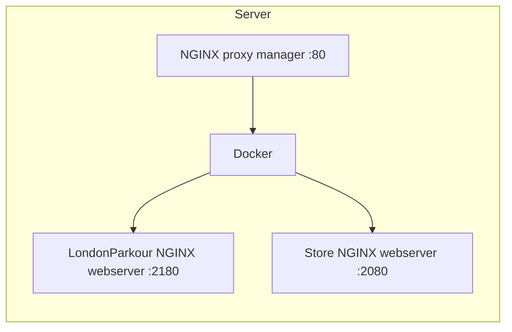

  

<div id="top"></div>

  

<div align="center">

  


  

<h3 align="center">London Parkour Store Infrastructure & Deployments</h3>

  

<p align="center">

The docker-compose infrastructure and methods of deploying code / updates to the website.

</p>

</div>

  

## 1. <a name='TableofContents'></a>Table of Contents

  

  

## 2. <a name='AboutTheProject'></a>About The Project


## 2.1 The basics

This repository holds the `docker-compose.yml` file that will build the correct infrastructure within docker for the LondonParkour store wordpress website.

There are three containers with two volumes




## 2.2 Updating the infrastructure

All secrets and configuration are held in the `.env` file that is held within the GitHub secrets variable. Use base64 when updating the configuration.

You can then run the GitHub action on the repository to deploy onto the self-hosted runner on the same server. This runner will then pull any changes to the code or `.env` file and run `docker compose up -d` on the server.



## 2.3 Traffic / Server Infrastructure

To host multiple sites on the server you need to run an NGINX reverse proxy to point to multiple containers. Therefore the `nginx-proxy-manager` project is running on the server directing traffic and supplying certificates when needed. The proxy manager will forward on the correct traffic to the correct port / site.

Visit the manager at [manager.londonparkour.com](manager.londonparkour.com)




## 3. <a name='Usage'></a>Usage

## 3.1 Deploying new changes to infrastructure

To change the infrastructure, you can do the following:

1. Change the repository code and push to `master`
2. Update the `.env.live` code and run `cat .env.live | base64` then copy into the `ENV_LIVE_B64`  variable in github > settings > secrets & variables > Actions > Secrets
3. Run the github action manually Github > Actions > DigitalOcean_Deploy_Live > Run workflow
4. Check new infrastructure.


## 3.2 Deploy new website code

Use the `vump_site` tool to deploy new code up / down from a development version to live. The `vump` tool will copy the database SQL file and site code into a new backup image and push up to a container registry. You can then use the same tool to load the new code into the live site.

All variables for `vump` are stored within the same `.env` file. This specifies the correct site volume, database container, database credentials and repository to use.

### 3.2.1 Part 1 - Save (On Development Environment)

1. On the DEVELOPMENT instance on the website on your laptop. 
2. Login to the dockerhub repository account that stores the backups. `docker login --username londonparkourstore --password ???`
3. Edit the `.env` file if needed to make sure you have the correct settings. If any settings are missing, `vump_site` will ask the question.
4. Make sure you have the `vump` and `vump_site` tools installed [https://github.com/IORoot/docker-vump](https://github.com/IORoot/docker-vump) and they are linked in the `/usr/local/bin` folder. `vump_site` runs `vump`.
5. Run `vump_site` in the same folder as the `.env` file and push the backup up to the repository.

### 3.2.2 Part 2 - Load (On Production Environment)

1. SSH into the production server
2. Make sure you have the `vump` and `vump_site` tools installed [https://github.com/IORoot/docker-vump](https://github.com/IORoot/docker-vump) and they are linked in the `/usr/local/bin` folder. `vump_site` runs `vump`.
3. Move into the folder with the live `.env` file. `cd /home/runner/actions-runnner-londonparkourstore/_work/londonparkourstore/londonparkourstore`
4. Login to the dockerhub repository account that stores the backups. `docker login --username londonparkourstore --password ???`
5. Run the `vump_site` and load the data from the repository.

### Notes

Within the `.env` file on both the local and live sites, the VUMP parts should be the same if you are using the same infrastructure on both.


## 3.3 The Actions-Runner

There is a self-hosted github runner on the box with a user `/home/runner`. There are currently three runners, one for the store, one for londonparkour.com and one for the nginx-proxy-manager.
You can start / stop / status the runner with the commands:

(Note `action-runner` was the first runner on the server and the store was used for this one. Which is why it doesn't have a suffix actions-runner-store)
```bash
/home/runner/actions-runner/svc.sh start
/home/runner/actions-runner/svc.sh stop
/home/runner/actions-runner/svc.sh status
/home/runner/actions-runner/svc.sh install
/home/runner/actions-runner/svc.sh uninstall
```

## 3.4 PHP
---
You can configure the `php.ini` file by editing the `/config/php/uploads.ini` file and restarting the `wordpress` container.


## 4. <a name='Troubleshooting'></a>Troubleshooting

## 4.1 Things to check:

- `.env`
- `.env.live` has been put into github correctly.
- `fastcgi_pass londonparkourstore_wordpress:9000;` line in the `config/nginx/nginx-conf-live/nginx.conf` file.
- correct ports / ssl in the [manager](manager.londonparkour.com)

  
  

## 6. <a name='Changelog'></a>Changelog

v1.0.0
- Initial deployment to docker for infrastructure.

